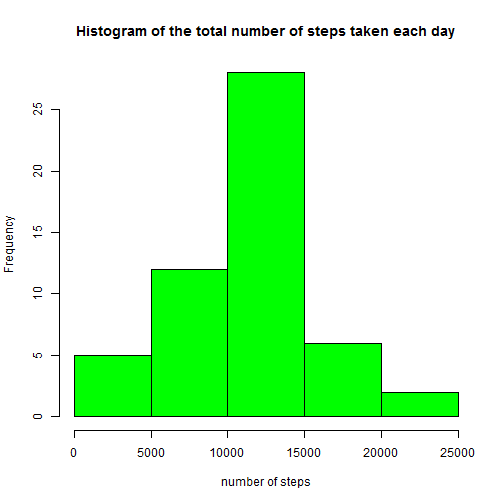
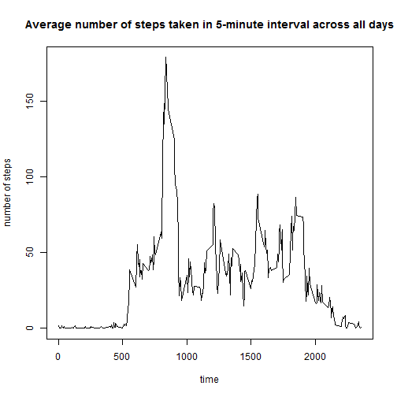
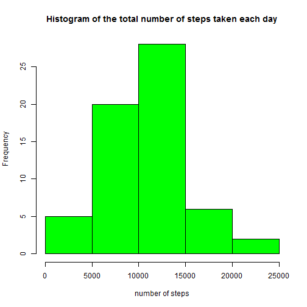
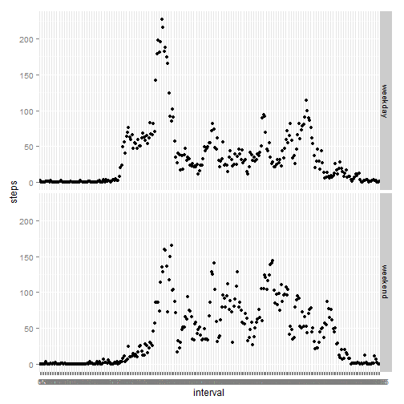

#**Reproducible research - Programming Assignment 1**

This R markdown report helps answer the various questions related to the personal activity monitoring. The report and answers are based on sample data pulled from the [course website](https://d396qusza40orc.cloudfront.net/repdata%2Fdata%2Factivity.zip)

##Description of data
-Dataset: [Activity monitoring data](https://d396qusza40orc.cloudfront.net/repdata%2Fdata%2Factivity.zip) [52K]

The variables included in this dataset are:

-steps: Number of steps taking in a 5-minute interval (missing values are coded as NA)

-date: The date on which the measurement was taken in YYYY-MM-DD format

-interval: Identifier for the 5-minute interval in which measurement was taken


## What is mean total number of steps taken per day?

```r
fileUrl <- "https://d396qusza40orc.cloudfront.net/repdata%2Fdata%2Factivity.zip"
#Download and unzip in "getdata" directory
if(!file.exists("getdata")) dir.create("getdata") 
download.file(fileUrl, destfile = "getdata/activity.zip")
unzip("getdata/activity.zip", exdir="getdata")
activityData <- read.csv("./getdata/activity.csv")
stepsEachDay <- aggregate(activityData$steps, by=list(date=activityData$date), FUN=sum)
with(stepsEachDay, hist(x, col = "green", xlab =  "number of steps", 
                        main = "Histogram of the total number of steps taken each day"))
```

 

Mean of total number of steps taken each day : 

```r
mean(stepsEachDay$x, na.rm=TRUE)
```

```
## [1] 10766.19
```
Median of total number of steps taken each day : 

```r
median(stepsEachDay$x, na.rm=TRUE)
```

```
## [1] 10765
```

## What is the average daily activity pattern?

```r
activityData$interval <- as.factor(activityData$interval)
stepsEachInterval <- tapply(activityData$steps, activityData$interval, sum, 
                            na.rm = TRUE, simplify = TRUE)/length(levels(activityData$date))
plot(x = levels(activityData$interval), y = stepsEachInterval, type = "l", xlab = "time", 
     ylab = "number of steps", 
     main = "Average number of steps taken in 5-minute interval across all days")
```

 

Which 5-minute interval, on average across all the days in the dataset, contains the maximum number of steps?

```r
which.max(stepsEachInterval)
```

```
## 835 
## 104
```
##Inputing missing values
1. Calculate and report the total number of missing values in the dataset (i.e. the total number of rows with NAs)

```r
sum(is.na(activityData$steps))
```

```
## [1] 2304
```
No missing values in interval and date fields in the data frame.

2. Devise a strategy for filling in all of the missing values in the dataset. The strategy does not need to be sophisticated. For example, you could use the mean/median for that day, or the mean for that 5-minute interval, etc.
Total Percentage of NAs in the dataset:

```r
mean(is.na(activityData$steps))
```

```
## [1] 0.1311475
```
Replace the missing values with the average no of steps taken in every 5 minute interval over all the days

3. Create a new dataset that is equal to the original dataset but with the missing data filled in.

```r
naLessActivityData <- activityData
for (i in 1:nrow(naLessActivityData)) {
     if(is.na(naLessActivityData$steps[i])) {
         naLessActivityData$steps[i] <- stepsEachInterval[
           paste("", naLessActivityData$interval[i], "", sep="")]
     }
}
```

4. Make a histogram of the total number of steps taken each day and Calculate and report the mean and median total number of steps taken per day. Do these values differ from the estimates from the first part of the assignment? What is the impact of imputing missing data on the estimates of the total daily number of steps?

```r
stepsEachDay <- aggregate(naLessActivityData$steps,   by=list(date=naLessActivityData$date), FUN=sum)
with(stepsEachDay, hist(x, col = "green", xlab =  "number of steps", 
                      main = "Histogram of the total number of steps taken each day"))
```

 

Mean of total number of steps taken each day : 

```r
mean(stepsEachDay$x)
```

```
## [1] 10581.01
```
Median of total number of steps taken each day : 

```r
median(stepsEachDay$x)
```

```
## [1] 10395
```
As can be seen, the mean and median have decreased after relacing the NAs with average values.
##Are there differences in activity patterns between weekdays and weekends?
1. Create a new factor variable in the dataset with two levels – “weekday” and “weekend” indicating whether a given date is a weekday or weekend day.

```r
for(i in 1:nrow(naLessActivityData)) {
     day = weekdays(as.Date(naLessActivityData$date[i]), abbreviate = TRUE)
     isWeekDay <- grep("Mon|Tue|Wed|Thu|Fri", day, ignore.case = TRUE)
     if(length(isWeekDay) > 0) { 
         naLessActivityData$day[i] <- "weekday"
     } else {
         naLessActivityData$day[i] <- "weekend"
     }
}
naLessActivityData$day <- as.factor(naLessActivityData$day)
```
2. Make a panel plot containing a time series plot (i.e. type = "l") of the 5-minute interval (x-axis) and the average number of steps taken, averaged across all weekday days or weekend days (y-axis).

```r
library(ggplot2)
averages <- aggregate(steps ~ interval + day, data = naLessActivityData, mean)
qplot(interval, steps, data = averages, facets = day ~ ., method = "lm")
```

 

During weekdays we observe peak steps but the activity is generally higher during the later hours in weekends
